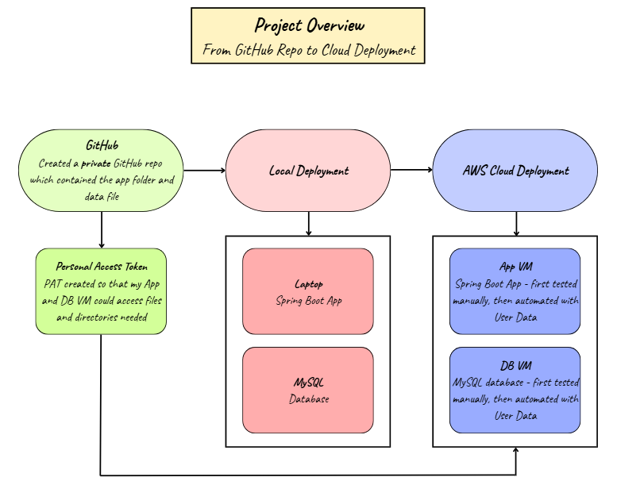
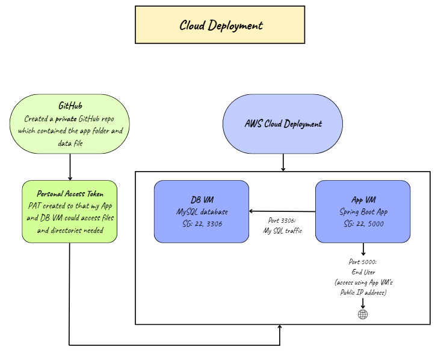
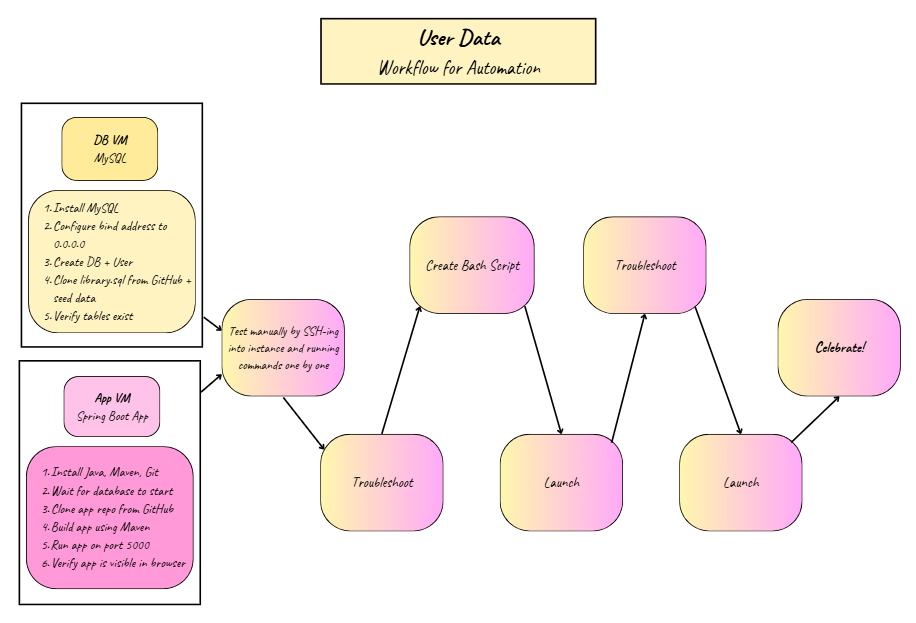
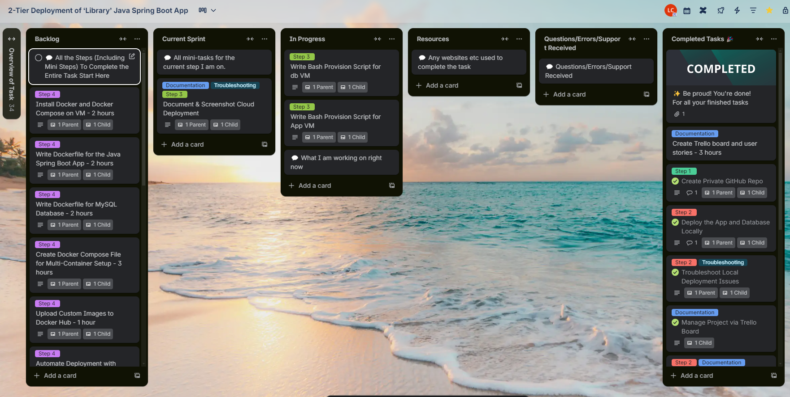
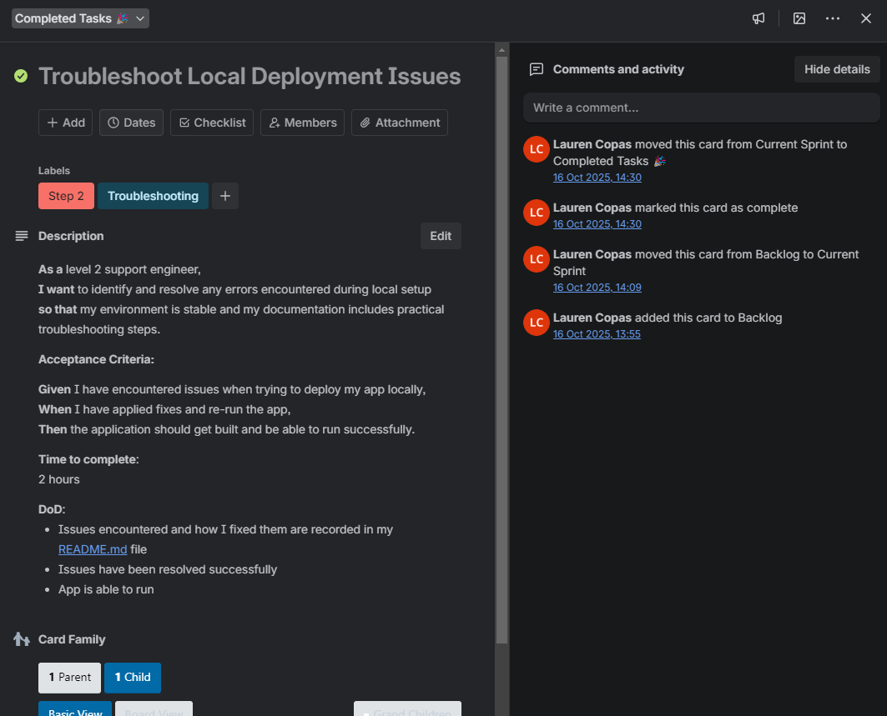

# 2-Tier Deployment of ‘Library’ Java Spring Boot App

- [2-Tier Deployment of ‘Library’ Java Spring Boot App](#2-tier-deployment-of-library-java-spring-boot-app)
  - [🧭 Overview](#-overview)
  - [🧩 Key Technologies \& Concepts](#-key-technologies--concepts)
  - [⚙️ Step 1 – Create Private GitHub Repo](#️-step-1--create-private-github-repo)
    - [🪜 Actions Taken](#-actions-taken)
  - [⚙️ Step 2 – Deploying App \& Database Locally (Windows + Git Bash)](#️-step-2--deploying-app--database-locally-windows--git-bash)
    - [🧰 Tools Used](#-tools-used)
    - [✅ 2.0 Open the Project](#-20-open-the-project)
    - [✅ 2.1 Verify Java 17 is Installed](#-21-verify-java-17-is-installed)
    - [✅ 2.2 Ensure MySQL Client is on PATH](#-22-ensure-mysql-client-is-on-path)
    - [✅ 2.3 Check MySQL Server is Running](#-23-check-mysql-server-is-running)
    - [✅ 2.4 Create Database + App User](#-24-create-database--app-user)
    - [✅ 2.5 Seed Database from `library.sql`](#-25-seed-database-from-librarysql)
    - [✅ 2.6 Install Maven](#-26-install-maven)
    - [✅ 2.7 Set Environment Variables](#-27-set-environment-variables)
    - [✅ 2.8 Run the Application](#-28-run-the-application)
    - [🧩 Troubleshooting and Fixes](#-troubleshooting-and-fixes)
    - [🎯 Why This Step Matters](#-why-this-step-matters)
    - [🌱 Benefits](#-benefits)
  - [⚙️ Step 3 - Deploying the App and DB using AWS Instances](#️-step-3---deploying-the-app-and-db-using-aws-instances)
    - [🧰 Tools Used](#-tools-used-1)
    - [✅ 3.0 Create Two Security Groups](#-30-create-two-security-groups)
      - [🧩 tech511-lauren-library-spring-boot-db](#-tech511-lauren-library-spring-boot-db)
      - [🧩 tech511-lauren-library-spring-boot-app-sg](#-tech511-lauren-library-spring-boot-app-sg)
    - [✅ 3.1 Launch Database Instance](#-31-launch-database-instance)
    - [✅ 3.2 Launch Application Instance](#-32-launch-application-instance)
    - [✅ 3.3 Verify Connections](#-33-verify-connections)
    - [🧩 Troubleshooting and Fixes](#-troubleshooting-and-fixes-1)
    - [🎯 Why This Step Matters](#-why-this-step-matters-1)
    - [🌱 Benefits](#-benefits-1)
  - [🌐 Websites Used Whilst Researching/Troubleshooting](#-websites-used-whilst-researchingtroubleshooting)
  - [🖼️ Diagrams \& 📷 Screenshots](#️-diagrams---screenshots)
    - [🗺️ Architecture and Flow Diagrams](#️-architecture-and-flow-diagrams)
      - [Project Overview: From GitHub to Cloud](#project-overview-from-github-to-cloud)
      - [2-Tier Cloud Deployment: Final Production-Style Layout](#2-tier-cloud-deployment-final-production-style-layout)
      - [User Data Automation: Workflow Showing What Gets Automated on Each VM](#user-data-automation-workflow-showing-what-gets-automated-on-each-vm)
    - [🎫 Project Management](#-project-management)
      - [Trello Board Overview: Lists and Workflow](#trello-board-overview-lists-and-workflow)
      - [Task Ticket Example: User Story, Acceptance Criteria and DoD](#task-ticket-example-user-story-acceptance-criteria-and-dod)
  - [Key Learning](#key-learning)
  - [🪞 Final Reflection](#-final-reflection)

## 🧭 Overview

This project demonstrates the 2-tier deployment of a **Java Spring Boot appl** connected to a **MySQL database**.  
The overall goal was to understand how backend applications communicate with databases, and how to deploy, manage and automate that connection through various methods — including **local setup**, **virtualisation**, and **containerisation**.
<br>
<br>

<br>
<br>
This document is a **working technical guide**, designed to be:
- A record of every step I took to implement and troubleshoot the app.
- A reusable instruction manual for future me (and future colleagues) to follow and recreate.
- A reflective log explaining **why** each step is done, and the **benefits** it provides — both for myself as a junior level 2 support engineer and for the Home Office as an organisation.
<br>

Usually, I would include my **troubleshooting** and **benefits** sections right near the end of the README. However - due to the size of this project, I have made the decision to include these sections for each step, so that it is easier to troubleshoot issues when using this guide, and to make it clear what the benefits are for that particular step.

## 🧩 Key Technologies & Concepts

| Technology                | Description                                                         | Why It’s Used                                                         |
|---------------------------|---------------------------------------------------------------------|-----------------------------------------------------------------------|
| **Java 17 (Spring Boot)** | Backend framework for building APIs and handling business logic.    | Provides structure, dependency management, and simplifies deployment. |
| **MySQL 8.0**             | Relational database used to store and retrieve application data.    | Stable, widely supported and integrates well with Java applications.  |
| **Maven**                 | Build automation and dependency management tool for Java projects.  | Handles build lifecycle, compiles code and runs the app via `mvn spring-boot:run`. |
| **GitHub**                | Source control repository.                                          | Keeps code versioned, organised and shareable. |
| **Environment Variables** | Secure way to configure credentials (DB host, user, password).      | Prevents hard-coding of sensitive data. |
| **cURL**                  | Command-line tool to test API endpoints.                            | Quickly checks if the app is returning data correctly. |

## ⚙️ Step 1 – Create Private GitHub Repo

### 🪜 Actions Taken
- Created a private GitHub repo library-java17-mysql-app.
- Pushed local repo to GitHub:
  - LibraryProject2/ (Spring Boot app)
  - library.sql (schema + seed data)
- Created a GitHub Personal Access Token (PAT) with repo scope to allow EC2 instances to clone the private repo.
- Stored the PAT safely in my .ssh folder locally (only pasted into AWS User data at launch).
- Verified repo structure (so user-data scripts can pull exactly the files they expect).
  
## ⚙️ Step 2 – Deploying App & Database Locally (Windows + Git Bash)

> **Goal:** Run the Spring Boot app in `LibraryProject2` connected to a local MySQL database seeded by `library.sql`.

### 🧰 Tools Used
- **Git Bash** (main terminal)
- **PowerShell** (for Windows package installs only)
- **MySQL Workbench** (to start/stop the server)

### ✅ 2.0 Open the Project
```
cd "/c/Users/laure/github/library-java17-mysql-app"
ls
````
You should see: `LibraryProject2  library.sql`

### ✅ 2.1 Verify Java 17 is Installed

```
java -version
```

You should see: `openjdk version "17.x"`

If Java 17 is missing:

1. Download and install Temurin JDK 17.
2. Re-open Git Bash, then:

```
export JAVA_HOME="/c/Program Files/Eclipse Adoptium/jdk-17"
export PATH="$JAVA_HOME/bin:$PATH"
java -version
```

### ✅ 2.2 Ensure MySQL Client is on PATH

```
mysql --version   # to check whether it is installed already. If not - run the below command, then run this command again.
export PATH="$PATH:/c/Program Files/MySQL/MySQL Server 8.0/bin"
```

Make this persist for future sessions (learnt the hard way):

```
echo 'export PATH="$PATH:/c/Program Files/MySQL/MySQL Server 8.0/bin"' >> ~/.bashrc
source ~/.bashrc
```

### ✅ 2.3 Check MySQL Server is Running

```
winpty mysql -u root -p -e "SELECT VERSION();"
```

* If it prints a version → running
* If refused → start the server:

```
net start MySQL80
net start "MySQL Server 8.0"
```

### ✅ 2.4 Create Database + App User

> **Use root password when prompted.**
> App user password is for the application (e.g. `StrongPass123!`) - learnt when troubleshooting.

```
APP_DB_PASS='StrongPass123!' # Choose a password for the app - remember it as you will need it many times
winpty mysql -u root -p -e "\
CREATE DATABASE IF NOT EXISTS library; \
CREATE USER IF NOT EXISTS 'appuser'@'localhost' IDENTIFIED BY '${APP_DB_PASS}'; \
GRANT ALL PRIVILEGES ON library.* TO 'appuser'@'localhost'; \
FLUSH PRIVILEGES;"
```

### ✅ 2.5 Seed Database from `library.sql`

```
cd "/c/Users/laure/github/library-java17-mysql-app"
cat library.sql | mysql -u appuser -p -D library
# Will be prompted to enter the appuser password (e.g. StrongPass123!)
```


Verify:

```
mysql -u appuser -p -e "USE library; SHOW TABLES;"
```

### ✅ 2.6 Install Maven

1. Download **Apache Maven binary ZIP**
2. Extract somewhere easy to locate, e.g:

```
C:\Program Files\Apache\maven-3.9.x
```

3. In Git Bash:

```
export M2_HOME="/c/Program Files/Apache/maven-3.9.x"
export PATH="$M2_HOME/bin:$PATH"
mvn -version
```

Make it persistent:

```
echo 'export M2_HOME="/c/Program Files/Apache/maven-3.9.x"' >> ~/.bashrc
echo 'export PATH="$M2_HOME/bin:$PATH"' >> ~/.bashrc
source ~/.bashrc
```

### ✅ 2.7 Set Environment Variables

```
export DB_HOST='jdbc:mysql://127.0.0.1:3306/library?allowPublicKeyRetrieval=true&useSSL=false'
export DB_USER='appuser'
export DB_PASS='StrongPass123!'

export SPRING_DATASOURCE_URL="$DB_HOST"
export SPRING_DATASOURCE_USERNAME="$DB_USER"
export SPRING_DATASOURCE_PASSWORD="$DB_PASS"

echo "$DB_HOST"
```

Make it persistent for future sessions:

```
echo 'export DB_HOST="jdbc:mysql://127.0.0.1:3306/library?allowPublicKeyRetrieval=true&useSSL=false"' >> ~/.bashrc
echo 'export DB_USER="appuser"' >> ~/.bashrc
echo 'export DB_PASS="StrongPass123!"' >> ~/.bashrc
```

### ✅ 2.8 Run the Application

```
cd "/c/Users/laure/github/library-java17-mysql-app/LibraryProject2"
mvn spring-boot:run
```

**Expect log output:**

```
Tomcat started on port(s): 5000 (http)
HikariPool-1 – Added connection com.mysql.cj.jdbc.ConnectionImpl...
Started LibraryProject2Application ...
```

**Test locally:**

```
curl -i http://localhost:5000/authors
```

**Test in browser:** 
<br> <br> [http://localhost:5000/authors](http://localhost:5000/authors)

Stop the app in Bash:

```
CTRL + C
```

### 🧩 Troubleshooting and Fixes

| Problem                            | Cause                           | Fix                                                                |            
| ---------------------------------- | ------------------------------- | ------------------------------------------------------------------ | 
| `mysql: command not found`         | MySQL not on PATH               | `export PATH="$PATH:/c/Program Files/MySQL/MySQL Server 8.0/bin"`  |
| MySQL service not found            | Different service name          | Started via Workbench → Server Status → Start Server               |
| Root vs Appuser password confusion | Prompt doesn’t say which        | Root for admin, appuser for app — reset via `ALTER USER` if needed |
| `stdin is not a tty` on import     | Used `winpty` with `< file.sql` | Use `cat library.sql                                               | 
| `mvn: command not found`           | Maven not installed             | Install Maven + add to PATH                                        |
| `URL must start with 'jdbc'`       | Environment variable missing    | Set `DB_HOST` and `SPRING_DATASOURCE_*`                            |
| `Public Key Retrieval not allowed` | MySQL 8 auth nuance             | Add `allowPublicKeyRetrieval=true&useSSL=false`                    |
| 404 at root URL                    | No route at `/`                 | Use `/authors` endpoint                                            |

### 🎯 Why This Step Matters

* Simulates a real 2-tier stack (app ↔ DB) locally.
* Builds skills in config, auth, and diagnostics via logs.
* Provides a known-good baseline before VM, Ansible or Docker deployment.

### 🌱 Benefits

| For                     | Benefit                                                                               |
| ----------------------- | ------------------------------------------------------------------------------------- |
| **For me (Developer)**  | Hands-on practice linking Java and MySQL, managing env vars and builds via Maven.     |
| **For the Home Office** | Reliable, repeatable setup ensuring secure DB connections and better maintainability. |

## ⚙️ Step 3 - Deploying the App and DB using AWS Instances 

> **Goal:** Deploy the same Spring Boot + MySQL stack on AWS, using two EC2 instances in the same VPC:
- Database VM hosting MySQL and seeding library.sql
App VM building and running the Spring Boot app on port 5000
<br>


<br>

### 🧰 Tools Used
- **AWS EC2** (for my VMs)
- **AWS Security Groups**
- **Ubuntu 22.04 LTS AMI**
- **User Data scripts** (to automate setup for both instances)
- **GitHub PAT** (Personal Access Token - to clone my private repo)

### ✅ 3.0 Create Two Security Groups

**Create the following two Security Groups using the defaul VPC:

#### 🧩 tech511-lauren-library-spring-boot-db
- Inbound:<br>
  
|Type	     |Protocol	    |Port	   |Source	    |Purpose                           |
|----------|--------------|--------|------------|----------------------------------|
|SSH	     |TCP	          |22      |Your IP/32	|Allow admin SSH from your machine |
|MySQL/Aurora	|TCP	      |3306	   |App SG ID	  |Allow app VM to connect to DB     |

- Outbound: <br>
All traffic → 0.0.0.0/0

#### 🧩 tech511-lauren-library-spring-boot-app-sg
- Inbound:<br>
  
|Type	     |Protocol	    |Port	   |Source	    |Purpose    |
|----------|--------------|--------|------------|-----------|
|Custom TCP	     |TCP	          |5000      |Your IP/32	|Allow you to access app in browser |
|SSH	|TCP	      |22	   |Your IP/32	  |Allow admin SSH from your machine

- Outbound: <br>
All traffic → 0.0.0.0/0

💡 Don't open port 3306 to the world — only to the App SG.

### ✅ 3.1 Launch Database Instance

- AWS → EC2 → Launch instance

   - Name: tech511-lauren-library-db
   - AMI: Ubuntu Server 22.04 LTS (x86_64)
   - Type: t3.micro or t2.micro
   - Key pair: existing or new
   - VPC/Subnet: Default
   - Security Group: tech511-lauren-library-spring-boot-db
   - User Data
     - Open your repo folder → [/bash-scripts/db-script.sh](bash-scripts/db-script.sh)
     - Add your GitHub PAT into the GITHUB_TOKEN variable.
     - Paste the full script into the User data box (as plain text).
   - Launch the instance
   - Wait 2–3 minutes, then check MySQL is running:
```
mysql -u appuser -p'StrongPass123!' -e "SHOW DATABASES;"
mysql -u appuser -p'StrongPass123!' -e "SHOW TABLES FROM library;"
```

- Note down the Private IP (e.g. 172.31.xx.yy) for use in the next step, with the app VM.

### ✅ 3.2 Launch Application Instance

- AWS → EC2 → Launch instance
  - Name: tech511-lauren-library-app
  - AMI: Ubuntu Server 22.04 LTS (x86_64)
  - Type: t3.micro
  - VPC/Subnet: Default
  - Security Group: tech511-lauren-library-spring-boot-app-sg
  - User Data
    - Open your repo folder → [/bash-scripts/app-script.sh](bash-scripts/app-script.sh)
    - Set:
      - DB_HOST="add your DB private IP here"
      - Add your GitHub PAT into the GITHUB_TOKEN variable.
    - Paste the full script into the User data box (as plain text).
  - Launch the instance and wait 2–3 minutes.

### ✅ 3.3 Verify Connections
🔍 **Check DB VM**
```
sudo systemctl status mysql
sudo ss -ltnp | grep ':3306'
mysql -u appuser -p'StrongPass123!' -e "SELECT COUNT(*) FROM library.authors;"
```

What you should expect:
✅ MySQL active
✅ Listening on 0.0.0.0:3306
✅ Author count (e.g. 4)

🔍 **Check App VM**
```
sudo systemctl status library.service
sudo ss -ltnp | grep ':5000'
curl -s http://localhost:5000/web/authors | head -c 200
```

What you should expect:
✅ Java app running
✅ Port 5000 listening
✅ HTML or JSON output from /web/authors

🌐 **From your browser**

Go to:

`http://<APP_PUBLIC_IP>:5000/web/authors`


You ***should*** now see your author table! 🎉


### 🧩 Troubleshooting and Fixes

| Problem                            | Cause                                | Fix                                                                |            |
| ---------------------------------- | ------------------------------------ | ------------------------------------------------------------------ | ---------- |
| `ssh: connect to host ec2-54-216-198-249.eu-west-1.compute.amazonaws.com port 2 Connection timed out`         | My IP address had changed                | Go to inbound settings of SG on AWS, update IP address  |            |
| `ERROR 1064 (42000) at line 3: You have an error in your SQL syntax`            | Backticks in script confused shell          | Removed the backticks from my script               |            |
| Unable to SSH in after adding user data | SSH command has root not ubuntu             | Manually change 'root' to 'ubuntu in terminal  |            |
| Could not read Username for https://github.com | UGitHub token missing or invalid      | Recreate PAT with repo scope, update GITHUB_TOKEN                                               
| curl: (7) Failed to connect to localhost:5000          | App service not running                  | Check with sudo systemctl status library or review journalctl -u library                                        |            |
| `ECONNREFUSED` between app & db       | DB SG doesn’t allow App SG on port 3306                      | Fix inbound rule on DB SG                            |            |
| Table doesn't exist error | Typo (author vs authors)                 | Confirm library.sql schema matches code                    |            |
| App builds but doesn’t run                    | 		Missing .jar                      | Check mvn package output under /opt/library-src/repo    
| No output from /web/authors                    | 		Wrong DB IP or credentials            | Double-check DB_HOST, appuser, and password in user data    

### 🎯 Why This Step Matters

* Recreates a 2-tier AWS stack (application + database).
* Mirrors a real-world cloud deployment workflow.
* Reinforces my knowledge of:
  * Security Groups & least-privilege access
  * User data automation
  * Cross-instance communication via private IPs
* Shows me a different database integration (previously MongoDB, now MySQL)

### 🌱 Benefits

| For                     | Benefit                                                                               |
| ----------------------- | ------------------------------------------------------------------------------------- |
| **For me (Developer)**  | Full hands-on experience provisioning, securing, and configuring cloud-based services.    |
| **For the Home Office** | Demonstrates understanding of infrastructure fundamentals and DevOps deployment workflow. |

## 🌐 Websites Used Whilst Researching/Troubleshooting

- [Building an Application with Spring Boot](https://spring.io/guides/gs/spring-boot)
- [Java17 Installation](https://adoptium.net/temurin/releases/)
- [Install Maven on Windows](https://maven.apache.org/install.html)
- [MySQL 8.0 Reference Manual](https://dev.mysql.com/doc/refman/8.0/en/windows-start-service.html)
- [Another MySQL 8.0 Reference](https://dev.mysql.com/doc/refman/8.0/en/mysql-batch-commands.html)
- [Stack Overflow: Used when troubleshooting](https://stackoverflow.com/questions/50379839/connection-java-mysql-public-key-retrieval-is-not-allowed)
- [Learn Spring Boot](https://www.baeldung.com/spring-boot)
- [Introduction to Spring Boot](https://www.geeksforgeeks.org/springboot/introduction-to-spring-boot/)
- [Spring Boot Tutorial](https://www.geeksforgeeks.org/advance-java/spring-boot/)
- [Another Spring Boot Tutorial](https://www.w3schools.blog/spring-boot-tutorial)

## 🖼️ Diagrams & 📷 Screenshots
*This project includes a small set of visuals to make the workflow easier to follow for a non-technical stakeholder, some of which can also be seen above in the corresponding sections.*

### 🗺️ Architecture and Flow Diagrams

#### Project Overview: From GitHub to Cloud

<br>*This shows how my private repo, local deployment and AWS deployment all fit together*

#### 2-Tier Cloud Deployment: Final Production-Style Layout

<br>*This shows how the different elements are connected and accessed using the different ports*

#### User Data Automation: Workflow Showing What Gets Automated on Each VM

<br>*Left: what is installed and/or configured on each VM. Right: iteration, launch and verification process*

### 🎫 Project Management

#### Trello Board Overview: Lists and Workflow

<br>*My Trello board illustrates how I structured my project using agile methods — moving tasks from Backlog → In Progress → Completed to track progress clearly.*

- I found a template on Trello which I could adapt for the project
- I thought carefully about the lists and what would be helpful for me to include
- I had an overview list, where I could see all the tickets needed from beginning to end of the project. I then had the more detailed tickets (see below) which I created in the backlog and could move to my current sprint list (essentially, the current sprint was the specific step I was working on). I would then move the specific ticket(s) I was working on to the 'in progress' column. From there, when it was completed, I would tick completed and move the ticket to the completed list.
- I found this really helpful but, in hindsight, I think I spent too long creating this considering the length of time we had. I felt it would be good practise creating user stories, acceptance criteria and DoDs, but if I added up time, I think I spent upwards of 4 hours on this alone. 
- I also have realised, even though I did a great deal of research and reached out for help as needed to colleagues, I never documented this. Whether I should have remembered to add to those lists, or if it means those lists where unnecessary, I'm not sure.
- Trello board can be viewed by clicking here: [2-Tier Deployment of 'Library' Java Spring Boot App](https://trello.com/invite/b/68f0d73f9ffc3822713b6374/ATTI8e47734162af435e432ceb642970103d56BD5327/2-tier-deployment-of-library-java-spring-boot-app)

#### Task Ticket Example: User Story, Acceptance Criteria and DoD

<br>*An individual Trello card example showing user stories, acceptance criteria, and “Definition of Done” — helping me ensure that each step of the project was fully completed before moving on.* 

## Key Learning

| Topic                             | What I Learned                                                                                                                                      | Why It Matters                                                              |
| --------------------------------- | --------------------------------------------------------------------------------------------------------------------------------------------------- | --------------------------------------------------------------------------- |
| **Private Repo on EC2**           | When IAM roles aren’t available, a short-lived Personal Access Token (PAT) in user data allows EC2 instances to clone private GitHub code securely. | Enables automation without exposing credentials in code.                    |
| **Idempotent User Data**          | I wrote both scripts to be idempotent — creating resources only if missing and retrying git clones.                                               | Prevents errors when instances reboot or re-deploy.                         |
| **Least-Privilege Networking**    | The DB Security Group only allows inbound connections from the App SG on port 3306, while the App SG exposes port 5000 only to my IP.               | Reflects real-world cloud security principles.          |
| **MySQL Seeding**                 | The database is seeded automatically using `library.sql` once the DB is provisioned.                                                                | Ensures consistent data setup across environments.                          |
| **Systemd Service Management**    | The Spring Boot app runs as a `systemd` service to start automatically and stay active after reboots.                                               | Improves reliability and mimics a production environment.                    |
| **Quick Diagnostics**             | Commands like `ss -ltnp`, `curl localhost:5000/...`, and `mysqladmin ping` quickly revealed network or app issues.                                  | Building strong troubleshooting habits and learning to reduce debugging time. (Work in progress!)           |
| **Security Groups vs. Firewalls** | Learned that AWS SGs filter *network* traffic, while apps must still listen on the correct interface and port.                                      | Made the difference between infrastructure and OS-level configuration clear. |

## 🪞 Final Reflection
Completing this project gave me hands-on experience building and automating a real-world 2-tier application using AWS. I learned how to troubleshoot system dependencies, configure secure network communication between virtual machines, and use user data to remove manual setup steps. The process deepened my understanding of cloud infrastructure, Linux, and deployment workflows — and built my confidence in working independently through complex technical challenges.
If I were to continue, I’d next explore containerising the app with Docker and integrating CI/CD pipelines to automate future deployments.